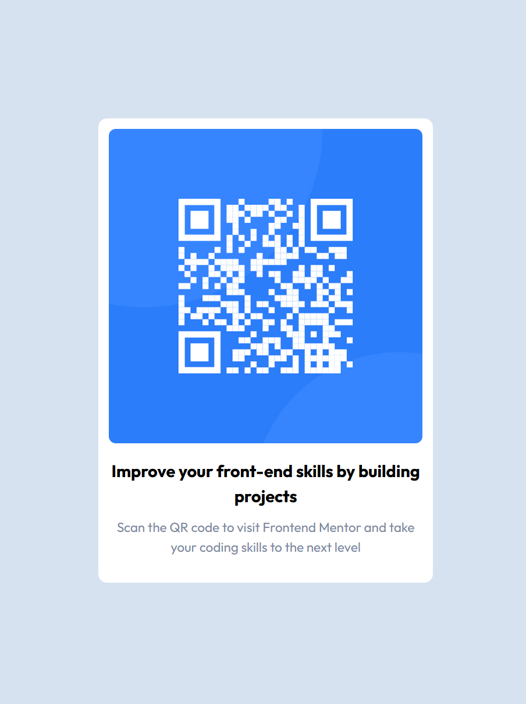

# Frontend Mentor - QR code component solution

This is a solution to the [QR code component challenge on Frontend Mentor](https://www.frontendmentor.io/challenges/qr-code-component-iux_sIO_H). Frontend Mentor challenges help you improve your coding skills by building realistic projects.

## Table of contents

- [Screenshot](#screenshot)
- [Links](#links)
- [My process](#my-process)
  - [Built with](#built-with)
- [Author](#author)

### Screenshot

### Links

- Solution URL: [Add solution URL here](https://your-solution-url.com)
- Live Site URL: [Add live site URL here](https://your-live-site-url.com)

## My process

- I approached it going from desktop to mobile layout. And used a common CSS reset from Josh Comeau

### Built with

- Semantic HTML5 markup
- CSS Grid
- Desktop-first workflow

## Author

- Frontend Mentor - [@rafastos](https://www.frontendmentor.io/profile/rafastos)

